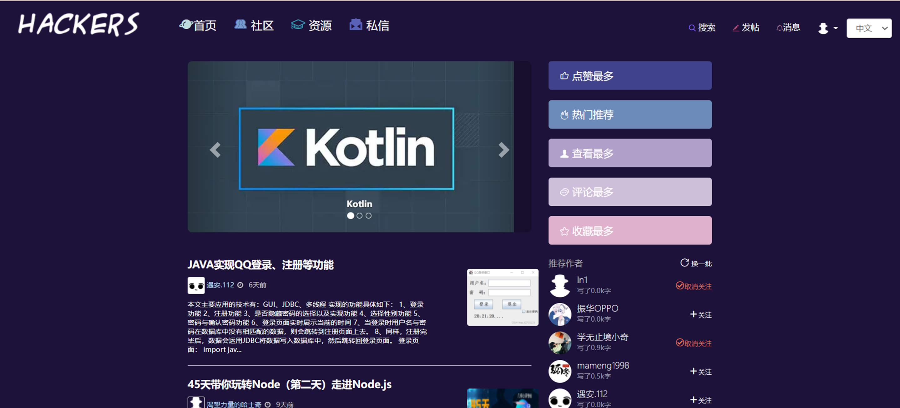
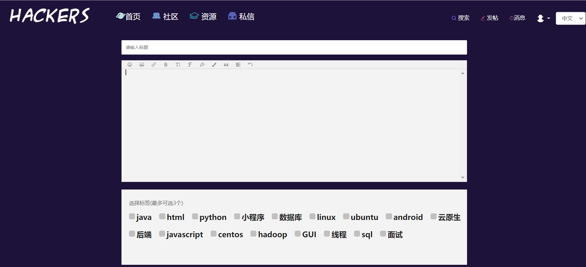
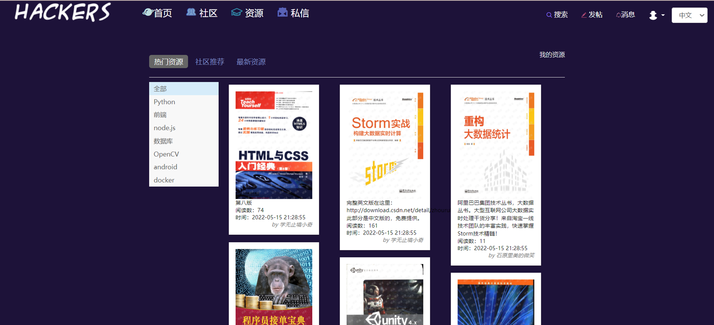

# Hackers 开发者交流学习平台
基于flask的多用户博客系统
## 相关技术

python:3.6.15

内容存储：mysql

图片、资源存储：[阿里云对象存储oss](https://blog.csdn.net/Doudou_Mylove/article/details/107060228)

邮箱注册: flask_email 

邮箱验证码：redis

celery email task


## ** How to use **
```bash
# 1.克隆到本地
git clone ...

# 2.安装依赖
pip install -r requirements.txt
```
[pip安装MarkupSafe==1.0失败解决方案](https://blog.csdn.net/h106140873/article/details/104794744/)


3.安装mysql以及redis并启动。
安装redis若报错：
```bash
redis.exceptions.ConnectionError: Error 10061 connecting to 47.107.66.196:6379. 由于目标计算机积极拒绝，无法连接。.
127.0.0.1 - - [07/May/2022 21:36:56] "POST /signup/ HTTP/1.1" 500 -
```
(安装redis](https://www.cnblogs.com/xiaodai0/p/9761192.html)

解决:把47.107.66.196改为127.0.0.1


4.修改config.py中的配置。将有关的变量写入用户变量。


5.数据库
先在mysql创建空数据库mycms
再迁移数据库
`python manage.py db migrate`

如果遇到[数据库迁移错误](https://stackoverflow.com/questions/32798937/cant-migrate-or-upgrade-database-with-flask-migrate-alembic)
do this:

```bash
python manage.py db stamp head
python manage.py db migrate
python manage.py db upgrade

```

```bash
# 6.映射数据库
python manage.py db upgrade

#可使用data/test.sql建立测试数据库
#项目示例数据部分来自互联网，如有侵权请联系我删除。

#管理员创建：
python manage.py add_cms_user -u your_username -p your_passowrd -e your_email

#快捷创建前端用户
python manage.py add_front_user -u your_username -p your_passowrd -e your_email

# 启动
python manage.py runserver
```
效果：



参考链接
[https://github.com/RelaxedDong/mycms](https://github.com/RelaxedDong/mycms)
